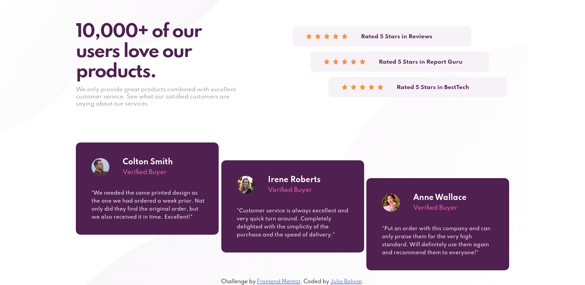

<h1 align="center">Social proof section</h1>

    Thanks for checking out this front-end coding challenge.

    Frontend Mentor challenges help you improve your coding skills by building realistic projects.

    To do this challenge, you need a basic understanding of HTML and CSS.

  <h3>
    <a href="https://julioribc.github.io/Social-proof-section/">
      Demo
    </a>
     | 
    <a href="https://github.com/Julioribc/Social-proof-section">
      Solution
    </a>
     | 
    <a href="https://www.frontendmentor.io/challenges/social-proof-section-6e0qTv_bA">
      Challenge
    </a>
  </h3>

<!-- TABLE OF CONTENTS -->

## Table of Contents

- [Overview](#overview)
- [Built With](#built-with)
- [Features](#features)
- [Contact](#contact)

<!-- OVERVIEW -->

## Overview

## Built With

- HTML
- CSS
- Bootstrap 5

## Contact

- GitHub [@Julioribc](https://github.com/Julioribc)
- Twitter [@Julioribc](https://twitter.com/Julioribc)